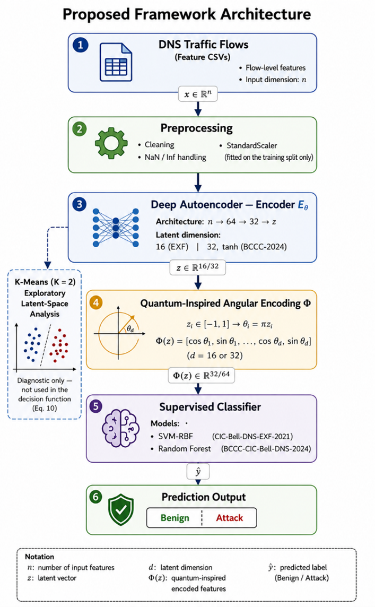

# A Deep Autoencoder and Quantum-Inspired Feature Encoding Framework for DNS Anomaly Detection

Official code, data-preparation scripts and reproducibility artifacts for the paper:

> **A Deep Autoencoder and Quantum-Inspired Feature Encoding Framework for DNS Anomaly Detection**
> N. M. Hussien, M. T. Gaata, H. B. Taher. *International Journal of Intelligent Engineering and Systems*, [year].

The framework combines a deep autoencoder, a quantum-inspired angular feature encoding (a cosine–sine projection onto the unit circle) and a supervised classifier (SVM-RBF / Random Forest), evaluated under a leakage-controlled protocol on two public benchmarks. The repository also contains the data-quality audit of CIC-Bell-DNS-EXF-2021 that quantifies its duplicate (56.8%) and label-conflict (65.3%) rates.

The angular encoding is a **classical periodic coordinate transformation** motivated by angle-encoding concepts from variational quantum circuits. It does not use superposition or entanglement and is not executed on quantum hardware.

---

## 1. Repository contents

| File | Purpose |
|---|---|
| `prepare_data.py` | Downloads both datasets (Kaggle), merges the CSVs, assigns labels, removes leakage-prone identifier columns, runs the duplicate/conflict audit |
| `experiments_main.py` | Main pipeline: preprocessing → autoencoder → angular encoding → classifier. Produces Tables 4, 4b, 5, 6, 7 and Fig. 4 |
| `tune_pipeline.py` | Architecture/hyperparameter search (latent dim × activation × SVM grid) |
| `model_tournament.py` | Classifier comparison on the full BCCC-2024 corpus (Table 8, Fig. 5) |
| `optuna_search.py` | 20-trial TPE Bayesian optimization over the joint AE + Random Forest space (Section 4.6, Appendix A) |
| `statistical_tests.py` | Paired t-test / Wilcoxon over identical five-fold splits (Table 10) |
| `complexity_explainability.py` | Training/inference timing, memory, parameters (Table 11) and feature-importance analysis (Table 12) |
| `verify_kmeans_on_real_data.py` | Latent-space K-Means diagnostic (Section 3.4) |
| `leakage_audit.py` | Deterministic majority-label ceiling, overlap statistics, group-disjoint evaluation (Section 4.2, Table 3b) |
| `encoding_study_colab.py` | Representation baselines, boundary and invertibility analysis, operational metrics (Section 4.11, Tables 13 and 14) |
| `make_artifacts.py` | Checksums, feature lists, excluded columns, split and fold indices, pinned environment |
| `requirements-lock.txt` | Exact package versions of the environment used for all reported results |

Note on `model_tournament.py`: the BCCC-2024 comparison covers **five classifier families in seven configurations**. Random Forest and XGBoost are run under both representations (raw and proposed); LightGBM and HistGradientBoosting are run on raw features only, as supplementary baselines; SVM (RBF) is run on the proposed representation only. It is not a full paired grid, and representation-effect conclusions in the paper are restricted to Random Forest and XGBoost.

---

## 2. Datasets

Both datasets are public and are **not redistributed here**, in accordance with their licences.

| Dataset | Source | Mirror used | Portion used |
|---|---|---|---|
| CIC-Bell-DNS-EXF-2021 | Canadian Institute for Cybersecurity / Bell Canada — https://www.unb.ca/cic/datasets/dns-exf-2021.html | Kaggle `humera11/cicbelldnsexf2021` | Heavy-exfiltration stateful subset |
| BCCC-CIC-Bell-DNS-2024 | Behaviour-Centric Cybersecurity Center, York University | Kaggle `bcccdatasets/malicious-dns-and-attacks-bccc-cic-bell-dns-2024` | Full Mal portion, leakage-prone columns removed |

### 2.1 Exact source files, sizes and checksums

`make_artifacts.py` records the file name, byte size, row count and SHA-256 of each prepared corpus in
`manifest.json` (written to `artifacts/` when run locally, released at the repository root here), together with the class counts. The prepared corpora are:

| Dataset | Prepared file | Rows | Numeric features retained | Columns excluded |
|---|---|---|---|---|
| CIC-Bell-DNS-EXF-2021 | `merged_heavy.csv` | 141,044 | 20 | 7 |
| BCCC-CIC-Bell-DNS-2024 | `merged_mal_clean.csv` | 499,467 | 100 | 13 |

The full SHA-256 digests are in `manifest.json` rather than duplicated here, so that the values a
reader checks against are the ones the script actually produced.

### 2.2 Label mapping

The label column is `label`, with `0` = benign and `1` = attack for both corpora. The mapping is recorded in
`manifest.json`.

### 2.3 Excluded columns

Identifier and leakage-prone columns removed before modelling (flow ID, timestamps, IP addresses and ports
for BCCC-2024) are listed in full under `excluded_columns` in `manifest.json` and in
`features_*.json`.

### 2.4 Retained feature list

The final feature sets are written to `features_CIC_Bell_DNS_EXF_2021.json` and
`features_BCCC_CIC_Bell_DNS_2024.json`.

### 2.5 Sampling procedure

`experiments_main.py` draws a stratified sample of 52,440 instances (35,895 benign, 16,545 attack) from
CIC-Bell-DNS-EXF-2021 for the SVM-based pipeline, with seed 42. The autoencoder for BCCC-2024 is fitted on a
100,000-row subsample of the training partition, also with seed 42. The leakage audit and the encoding study
use the full 141,044-row subset without subsampling.

---

## 3. Protocol, seeds and splits

All experiments fix `random_state = 42`. The scaler, the autoencoder and the angular-encoding min–max bounds are fitted on the training partition only.

* **Split:** stratified 80/20 train/test. The exact row indices are released as
  `train_indices_<dataset>.npy` and `test_indices_<dataset>.npy`, so the partition can be
  reconstructed without re-running the split.
* **Cross-validation:** stratified five-fold, shared across all compared configurations (the paired protocol
  of Section 4.8). Fold indices are released as `cv_folds_<dataset>.npz`. This is the **single
  authoritative cross-validation experiment**; the manuscript reports no other.
* **Optuna:** the full study is released as `optuna_study.db` and `optuna_trials.csv`, giving
  the configuration, the resulting representation dimensionality and the objective value of every trial
  (Appendix A, Table A1).
* **Audit and study outputs:** `leakage_audit_results.json` (deterministic label ceiling, overlap
  statistics, group-disjoint evaluation) and `encoding_study_results.json` (representation
  comparison, boundary analysis, threshold sweep).

**Known limitation.** The split is sample-level and stratified; it is not grouped by capture session, domain or source entity. Because CIC-Bell-DNS-EXF-2021 contains extensive exact duplication, identical feature vectors can fall on both sides of the boundary. `leakage_audit.py` reports the overlap statistics before and after splitting, and re-evaluates the pipeline under a group-disjoint split. Group-disjoint evaluation is identified as future work in the paper.

---

## 4. Environment

`requirements-lock.txt` records the exact package versions of the environment that produced the reported
results, generated with `pip freeze`. The principal versions are Python 3.12.13, TensorFlow 2.20.0 and
scikit-learn 1.6.1; the reported measurements were made on a Google Colab CPU runtime.

---

## 5. Quick start

```bash
pip install -r requirements.txt

python prepare_data.py                                # download, merge, audit, write configs and checksums
python experiments_main.py merged_heavy.csv label     # EXF-2021: Tables 4, 4b, 5, 6, 7; Fig. 4
python model_tournament.py                            # BCCC-2024: Table 8; Fig. 5
python optuna_search.py                               # Section 4.6 and Appendix A
python statistical_tests.py                           # Table 10
python complexity_explainability.py                   # Tables 11 and 12
python leakage_audit.py merged_heavy.csv label        # Table 3b, deterministic ceiling
python encoding_study_colab.py                        # Tables 13 and 14
python make_artifacts.py                              # checksums, feature lists, split indices
```

The audit and study scripts write their numerical output to JSON, so that the values quoted in the paper can be traced to a file.

---

## 6. Key results

| Dataset | Setting | Accuracy | Notes |
|---|---|---|---|
| CIC-Bell-DNS-EXF-2021 | AE(16) + QIE + SVM-RBF | 79.25% | attack recall 98.82%; five-fold CV 79.65% ± 0.35% |
| BCCC-CIC-Bell-DNS-2024 | AE(32, tanh) + QIE + RF | 88.00% | 0.68 points below the best raw-feature model in accuracy, 0.0099 below in AUC-ROC and 0.0178 below in attack F1 |

The 88.00% result uses a 64-dimensional encoded representation against 100 raw features. On EXF-2021 the encoded representation is **not** a dimensional reduction: 20 raw features are compressed to 16 latent dimensions and then expanded to 32 cosine–sine components.

The data-quality audit shows that accuracies of 99%+ previously reported on CIC-Bell-DNS-EXF-2021 arise from duplicate leakage under random splits; see Section 4.2 of the paper.

---

## 7. Citation

```bibtex
@article{dnsqie2026,
  title   = {A Deep Autoencoder and Quantum-Inspired Feature Encoding
             Framework for DNS Anomaly Detection},
  author  = {Hussien, Nadia Mahmood and Gaata, Methaq Talib and Taher, Hazeem B.},
  journal = {International Journal of Intelligent Engineering and Systems},
  year    = {[year]},
  note    = {Code: https://github.com/Nadi-989/DNS_QUA}
}
```

## 8. License

MIT — see `LICENSE`. The licence covers the code in this repository only; the datasets remain under the terms of their respective providers.
